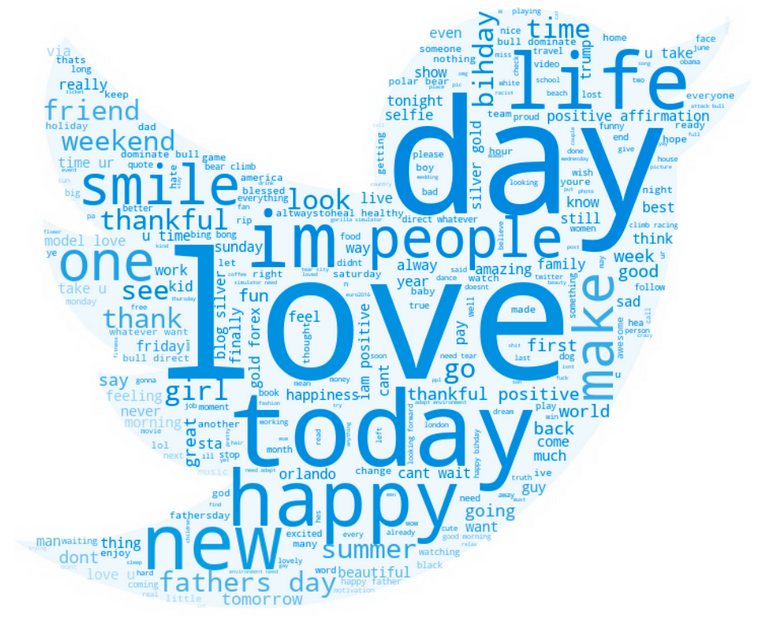
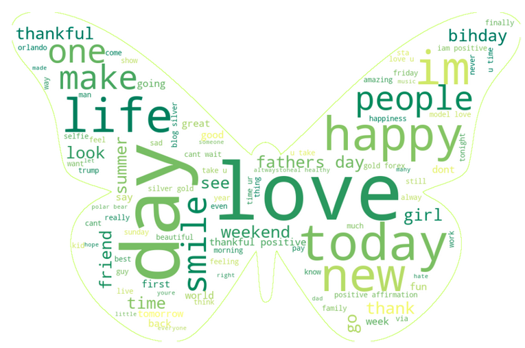

# Custom Twitter Wordcloud Plots

This notebook uses a dataset of tweets that have been labeled as positive (0) or negative (1). The wordcloud plot will use the entire dataset.

## Steps to create these plots

---

**Perform data exploration**

* Make sure there are no missing values
* Review the positive vs the negative tweets
* Plot charts to show positive vs negative tweets

**Perform data cleanup with a pipeline**

* Remove punctuation
* Remove stopwords
* Remove non-ascii chars

**Plot the Wordcloud using masks and colormaps**

1. Use the Twitter logo as a mask to display the wordcloud

2. Use a butterfly image as a mask to display the wordcloud

<em> [Dataset source: Coursera Course] </em>